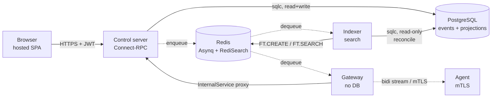

# Architecture

Six runtime components: a Postgres event store, a Valkey task queue and search index, three Go services (control, gateway, indexer), and Traefik in front of all of it. The web UI doesn't appear in the diagram as a process. It's a hosted SPA running in the operator's browser.

## Control server

<!-- docref: begin src=server:internal/store/store.go#Store.AppendEvent:d18121d5,server:cmd/indexer/main.go:259813c9 -->
The control server is the only thing that **writes** to Postgres. Every state change goes through its `AppendEvent` path. The indexer reads Postgres read-only as part of its drift-reconciliation loop (see below); the gateway and agent never touch Postgres at all.
<!-- docref: end -->

It runs on `:8081` and hosts:

<!-- docref: begin src=sdk:proto/pm/v1/control.proto#ControlService:4add8f59,server:cmd/control/main.go#main:997b3c43,sdk:proto/pm/v1/internal.proto#InternalService:8786ba93,server:cmd/control/flags.go#parseFlags:d739daf2 -->
- The Connect-RPC `ControlService` over HTTPS plus JWT for the web UI and CLI (167 RPCs across users, devices, actions, assignments, groups, IdPs, SCIM, TOTP, compliance, audit, search)
- The `SSOCallback` RPC that completes the OIDC code exchange for SSO sign-in
- The SCIM v2 endpoint at `/scim/v2/{slug}/` for IdP user and group provisioning
- The internal mTLS-protected `InternalService` on `:8082` that the gateway calls for credential-bearing operations (LUKS keys, LPS passwords, auto-update info)
<!-- docref: end -->

<!-- docref: begin src=server:internal/projectors/wire.go#WireAll:c0a71065,server:internal/store/store.go#Store.fireListeners:12d04dc9 -->
State changes go into the event store. Reads come from projection tables that Go listeners keep current after each commit.
<!-- docref: end -->

## Gateway

<!-- docref: begin src=server:internal/config/config.go#FromEnv:76de60f2,server:internal/taskqueue/sign.go:60bf637c -->
The gateway terminates agent mTLS and runs the bidirectional Connect-RPC stream on `:8080`. When the remote terminal is configured, it also runs a separate cleartext terminal-WebSocket listener (`GATEWAY_WEB_LISTEN_ADDR`; Traefik terminates the public TLS for it). No database. No credentials. Action dispatches arrive as Asynq tasks the control server enqueues; agent-reported execution events flow back through a separate Asynq inbox queue. Every Asynq envelope carries an HMAC (keyed by `PM_TASK_SIGNING_KEY`) so a compromised Valkey can't forge tasks.
<!-- docref: end -->

<!-- docref: begin src=server:internal/gateway/registry/traefik.go#Registry.PublishTraefikRoute:2c6834bb -->
Multi-gateway topology is supported via Redis self-registration: each gateway publishes its Traefik route config (TTL'd registry keys, refreshed by heartbeat) into Valkey on boot, and Traefik routes by SNI. Traffic for an agent goes to whichever gateway holds its current stream.
<!-- docref: end -->

## Indexer

<!-- docref: begin src=server:cmd/indexer/main.go:259813c9 -->
The indexer is a stateless service that drains search-related events off Asynq and writes search indexes into Valkey. It also runs a periodic reconciliation against Postgres (default every 1h, configurable) to repair drift if a write got lost. For that reconciliation pass it reads Postgres directly (read-only).
<!-- docref: end -->

Always run at least one indexer instance. Listing pages in the web UI (devices, actions, action sets, users, audit events, …) are search-backed; without an indexer, search returns nothing and those lists go blank. Scale to several instances if your search QPS gets serious.

## Agent

The agent runs as root on managed Linux endpoints. It:

<!-- docref: begin src=agent:internal/deviceauth/enroll_server.go#EnrollSocketPath:9838543e,agent:cmd/power-manage-agent/cert_rotation.go#renewAt:211ccaeb,sdk:proto/pm/v1/actions.proto#ActionType:89f99edb,agent:internal/executor/agent_update.go#executeAgentUpdate:6e49e8f9 -->
- Enrols once through a local Unix socket using a registration token. No sudo required to enrol.
- Receives a CA-signed client certificate (1-year validity) and renews at 80% of its lifetime
- Streams heartbeats and execution results to the gateway over Connect-RPC bidi
- Executes 23 action types idempotently
- Keeps running scheduled work while disconnected and reconciles when it reconnects
- Self-updates on receipt of an `AGENT_UPDATE` action, verifying the new binary's SHA-256 before swap
<!-- docref: end -->

<!-- docref: begin src=sdk:proto/pm/v1/actions.proto#SignedActionEnvelope:05aac70b,sdk:verify/envelope.go#MarshalEnvelope:eeb40f10 -->
Each dispatch carries a CA signature over the deterministic wire bytes of the **entire** `SignedActionEnvelope` — action ID, type, params, desired state, timeout, schedule, and target device. The agent verifies the signature over the exact bytes it received and executes those same bytes, so a tampered, retargeted, or forged dispatch is rejected.
<!-- docref: end -->

## Web UI

The web UI is a SvelteKit SPA hosted separately from the server. Browsers fetch the SPA from the web host, then make all subsequent RPCs directly to the operator's control server. The web host serves static files plus a small proxy for OIDC callbacks and asset rewriting; it never sees fleet data, JWTs, or events. See [The web UI](/get-started/web-ui) for details.

## Why event sourcing?

Every state change is an immutable event. Projections are derived from the event log and can be rebuilt at any time.

<!-- docref: begin src=server:internal/store/migrations/002_event_store.sql:7ec3ab3a -->
That gets you a few things. The `events` table is the audit log, so there's no second source of truth to drift. Any past state is reconstructable for debugging. Adding a field is a new event, not a destructive migration. Every event carries an actor and a sequence number, so a missing entry is visible.
<!-- docref: end -->

See [Event sourcing](/concepts/event-sourcing) for the projector pattern.
