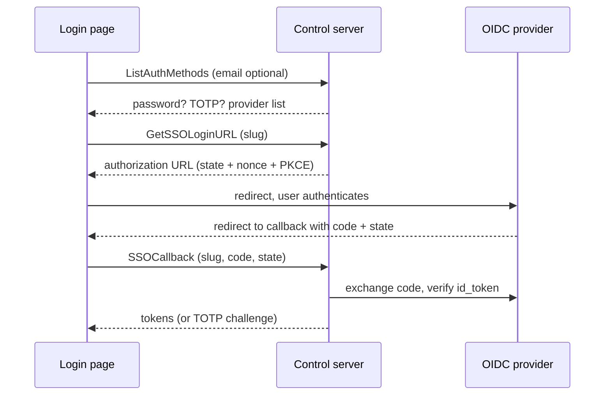

# SSO / OIDC login

Power Manage delegates login to OIDC identity providers (Google, Okta, Azure AD, Keycloak, …). Providers are configured over the API, stored as events like everything else, and served to the login page dynamically — no server restart to add or remove one.

## Configuring a provider

<!-- docref: begin src=server:internal/api/idp_handler.go#IDPHandler.CreateIdentityProvider:c8613dfa,server:internal/api/idp_handler.go#IDPHandler.UpdateIdentityProvider:dc787df3,server:internal/api/idp_handler.go#IDPHandler.DeleteIdentityProvider:052e9ed3 -->
`CreateIdentityProvider` / `UpdateIdentityProvider` / `DeleteIdentityProvider` are the CRUD RPCs. A provider carries a unique `slug` (rejected with `AlreadyExists` on collision), OIDC client credentials, an `issuer_url` for discovery (with optional `authorization_url` / `token_url` / `userinfo_url` overrides), scopes, and the linking flags described below. Updating with an empty `client_secret` keeps the existing secret. Deleting a provider unlinks every user linked through it, and auto-deletes users that end up with no password **and** no remaining identity link — routed through the same last-admin guard as a direct user delete, so removing an IdP can never remove the final administrator.
<!-- docref: end -->

<!-- docref: begin src=server:internal/crypto/crypto.go#Encryptor.EncryptWithContext:9ebf6086,server:internal/crypto/crypto.go#RowAAD:3ede87cd,server:internal/api/idp_handler.go#IDPHandler.idpToProto:694891bf -->
The client secret is encrypted at rest with AES-256-GCM under the server's 32-byte `CONTROL_ENCRYPTION_KEY` before it ever reaches the event store, AAD-bound to its own provider row (`<provider-id>|idp-client-secret`), and it is **never returned** in any RPC response — the proto conversion simply has no secret field.
<!-- docref: end -->


<!-- docref: begin src=server:internal/crypto/crypto.go#Encryptor.EncryptWithContext:9ebf6086,server:internal/crypto/crypto.go#SecretAAD:4ff6bd49,server:internal/crypto/crypto.go#RowAAD:3ede87cd -->
Every secret at rest uses a single AAD-bound `enc:v1:` format (spec 20): the ciphertext is tied to its row context, so a database-level attacker cannot relocate a secret between rows (or purposes) and have it decrypt. Device secrets (LUKS passphrases, LPS passwords) bind to `device|action|type`; row-owned secrets (IdP client secrets, TOTP secrets) bind to `<row-id>|<purpose>`. There is deliberately no unbound encryption API, and ciphertext in any retired format fails loudly instead of being silently mis-read.
<!-- docref: end -->


## The login flow

<!-- docref: begin src=server:internal/api/sso_handler.go#SSOHandler.ListAuthMethods:7b303794,server:internal/auth/interceptor.go#PublicProcedures:b21e2094 -->
`ListAuthMethods`, `GetSSOLoginURL`, and `SSOCallback` are public (pre-auth) procedures. `ListAuthMethods` returns whether password login is globally enabled, the enabled provider list, and — when an email is supplied — whether that account needs TOTP and whether a linked provider has disabled its password login. An unknown email gets the global defaults back, never a "no such user" signal.
<!-- docref: end -->

<!-- docref: begin src=server:internal/api/sso_handler.go#SSOHandler.GetSSOLoginURL:5a9d77c5,server:internal/idp/state.go#GenerateState:f5d67f7c,server:internal/idp/oidc.go#OIDCProvider.AuthCodeURL:aa9b2707 -->
`GetSSOLoginURL` generates a cryptographically random `state`, `nonce`, and PKCE code verifier, persists them as a one-shot auth-state row with a **10-minute expiry**, and returns the provider's authorization URL carrying the nonce and an S256 PKCE challenge.
<!-- docref: end -->

<!-- docref: begin src=server:internal/api/sso_handler.go#validateSSORedirectURL:74b691ab -->
The client-supplied `redirect_url` is allow-listed server-side: it must be empty (server falls back to `CONTROL_SSO_CALLBACK_BASE_URL` + `/auth/callback/<slug>`), same-origin with that configured base, or a loopback URL (`localhost` / `127.0.0.1` / `[::1]` — used by the CLI to receive the callback on a local port). Everything else is rejected with `InvalidArgument`, independent of whatever the IdP's own redirect-URI registration would do.
<!-- docref: end -->

<!-- docref: begin src=server:internal/api/sso_handler.go#SSOHandler.SSOCallback:ad304e73,server:internal/store/postgres/auth_state.go#AuthState.Consume:164a0127,server:internal/idp/oidc.go#OIDCProvider.VerifyAndExtractClaims:abea947e -->
`SSOCallback` consumes the state atomically (a single `DELETE … RETURNING` that also enforces the expiry, so a state can never be replayed), checks the slug matches the state's provider, exchanges the code with the PKCE verifier, and verifies the `id_token` signature, audience, and nonce before trusting a single claim. It then links or creates the user, syncs profile fields and group memberships from the claims, and issues tokens — or a TOTP challenge first if the account has TOTP enabled.
<!-- docref: end -->

<!-- docref: begin src=server:internal/idp/oidc.go#NewOIDCProvider:9ef3bed7,server:internal/idp/oidc.go#newBoundedOIDCClient:11067378 -->
All outbound OIDC calls (discovery, token exchange, JWKS fetch) run through an HTTP client with hard connect/handshake/response timeouts (12 s overall), so a slow or hostile IdP cannot hang a request indefinitely.
<!-- docref: end -->

## Linking, auto-creation, and the trust flags

<!-- docref: begin src=server:internal/idp/linker.go#Linker.LinkOrCreate:da50a57c -->
The linker resolves an external identity in this order:

1. **Existing link** on `(provider, subject)` → sign in as that user (a link pointing at a soft-deleted user is cleaned up and the flow falls through).
2. **`auto_link_by_email`** on and a local user has the asserted email → create the link and sign in as that user.
3. **`auto_create_users`** on → create a passwordless user (with a derived Linux username and the provider's `default_role_id`, if configured) and link it.
4. Otherwise: "no matching account found; contact an administrator".
<!-- docref: end -->

<!-- docref: begin src=server:internal/idp/oidc.go#VerifyAndExtractClaims:abea947e,server:internal/idp/oidc.go#claimIsTrue:bd65746a -->
On the OIDC path, the email claim is only trusted for auto-link/auto-create when the IdP asserts `email_verified` is true (boolean or the string `"true"`; absent counts as not-verified, fail closed). An unverified email is dropped before it ever reaches the linker, so an attacker who can register an arbitrary email at the IdP cannot use auto-link-by-email to take over the local account with that address.
<!-- docref: end -->


<!-- docref: begin src=server:internal/api/idp_handler.go#IDPHandler.CreateIdentityProvider:c8613dfa -->
`auto_link_by_email` defaults to **off** for new providers. Enabling it makes the IdP's email-verification policy a hard dependency of your local-account trust boundary; each actual auto-link is logged at info level with user and provider so it's visible in the audit trail.
<!-- docref: end -->


<!-- docref: begin src=sdk:proto/pm/v1/control.proto#IdentityProvider.trust_email_assertions:cb24a82d,server:internal/scim/users_create.go#Handler.createUser:21f88ec6 -->
`trust_email_assertions` (default false) is a separate, stronger opt-in that applies to the **SCIM** provisioning path: SCIM clients assert emails with no `email_verified` signal, so by default a SCIM auto-link-by-email that would bind an asserted email to a pre-existing **local password** account is refused with `409 Conflict` (account-takeover guard). Setting `trust_email_assertions: true` delegates email-identity assertion to that provider and allows the link. Passwordless / SSO-provisioned accounts link either way — there is no local credential to hijack.
<!-- docref: end -->

<!-- docref: begin src=server:internal/idp/linker.go#Linker.SyncGroupMemberships:efcbbaf6 -->
When a `group_claim` and `group_mapping` (external group name → user-group ID) are configured, every SSO login reconciles the user's membership in each **mapped** group — added to mapped groups the claims name, removed from mapped groups they don't. Unmapped groups are never touched. A claim-driven placement into an Admin-bearing group is logged as a warning for the audit trail.
<!-- docref: end -->

## Self-service identity links

<!-- docref: begin src=server:internal/api/identity_link_handler.go#IdentityLinkHandler.ListIdentityLinks:5d2b5ebb,server:internal/api/identity_link_handler.go#IdentityLinkHandler.UnlinkIdentity:de017f67 -->
`ListIdentityLinks` returns the calling user's own links (provider, external ID/email, linked-at, last login). `UnlinkIdentity` removes a link: non-admins can only unlink their own identities (admins holding `DeleteUser` can unlink anyone's), and the last authentication method is protected — a passwordless user cannot remove their final link without setting a password first.
<!-- docref: end -->

## Interaction with passwords and TOTP

<!-- docref: begin src=server:internal/api/auth_handler.go#AuthHandler.Login:b9a285f5 -->
`disable_password_for_linked` turns a provider into the *only* way in for its linked users: password login for them is rejected with the same generic invalid-credentials response (and the same dummy bcrypt timing) as a wrong password, so an unauthenticated caller can't probe which accounts are SSO-only. A lookup failure on that check denies login — fail closed. The login UI learns the right method from `ListAuthMethods`, not from login errors.
<!-- docref: end -->

<!-- docref: begin src=server:internal/api/sso_handler.go#SSOHandler.SSOCallback:ad304e73 -->
TOTP applies to SSO logins exactly as to password logins: if the account has TOTP enabled, `SSOCallback` returns a TOTP challenge instead of tokens, and the login isn't recorded until the second factor is verified. Disabled accounts are rejected after the IdP round-trip, before any token is issued.
<!-- docref: end -->
