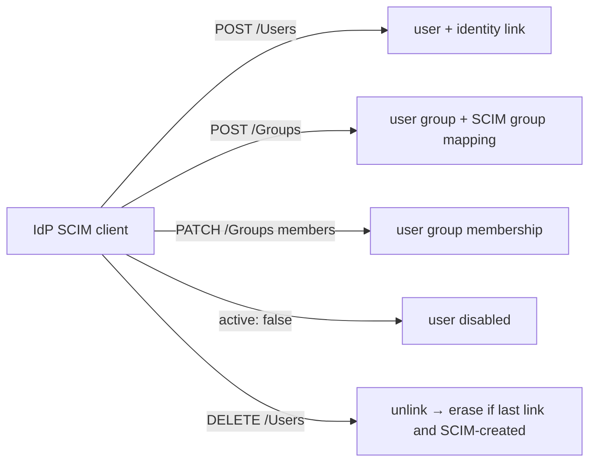

# SCIM v2 provisioning

SCIM lets your IdP (Okta, Entra ID, Keycloak, …) push users and groups into Power Manage instead of waiting for first sign-in. It complements [SSO](/concepts/sso): SSO authenticates, SCIM provisions and — critically — **de**provisions. Both paths record their changes as ordinary audited operations and effects, the same way the web UI's RPCs do, so the audit trail is uniform regardless of where a change came from.

## Enabling SCIM on a provider

<!-- docref: begin src=server:internal/identity/provider.go#Handlers.EnableSCIM:27245267,server:internal/identity/provider.go#Handlers.setSCIM:38c918fa -->
`EnableSCIM` is a per-identity-provider switch. It mints a bearer token from 32 bytes of cryptographic randomness (base64url-encoded), stores **only the token's SHA-256 digest**, and returns the plaintext token exactly once together with the endpoint URL (`<base>/scim/v2/<slug>`). There is no way to read the token again — losing it means rotating it.
<!-- docref: end -->

<!-- docref: begin src=server:internal/identity/provider.go#Handlers.RotateSCIMToken:c78c7baa,server:internal/identity/provider.go#Handlers.DisableSCIM:508a915e -->
`RotateSCIMToken` mints a fresh token the same way (again shown once, again only the digest stored), immediately invalidating the old one; it requires SCIM to actually be enabled and fails with `FailedPrecondition` otherwise. `DisableSCIM` turns the endpoint off for the provider and clears the stored digest, so a token issued earlier cannot be replayed if SCIM is later re-enabled; it is idempotent and does not require SCIM to have been on.
<!-- docref: end -->

## The endpoint surface

<!-- docref: begin src=server:internal/scim/handler.go#Handler.Mount:4a7df22e -->
All routes mount under `/scim/v2/{slug}/…`: discovery (`ServiceProviderConfig`, `Schemas`, `ResourceTypes`), Users (list/create/get/replace/patch/delete), and Groups (same verbs). Every route — including discovery — goes through bearer-token authentication.
<!-- docref: end -->

<!-- docref: begin src=server:internal/scim/auth.go#Handler.withAuth:33fa16d3,server:internal/scim/handler.go#Handler:836a9648 -->
Authentication digests the presented bearer token and compares it in constant time against the stored SHA-256 digest of a SCIM-enabled, login-enabled provider. Unknown slug, disabled provider, SCIM-disabled provider, missing token config, and wrong token all return an **identical** refusal, and the comparison runs on every one of those paths against a fixed all-zero digest no token can produce — so a client can't distinguish "slug exists" from "wrong token" by message or by work performed. Two rate-limit buckets run before the credential work: 100/min per provider slug and 20/min per (slug, client IP). A third bucket, also 20/min, bounds how many refusals get *recorded* per source, so the audit log can't be used as a write amplifier; throttling never changes what is admitted.
<!-- docref: end -->

<!-- docref: begin src=server:internal/scim/discovery.go#Handler.serviceProviderConfig:d497b27b -->
Discovery advertises what's actually implemented: PATCH and filtering (max 200 results) are supported; bulk operations, password sync, sorting, and ETags are not.
<!-- docref: end -->

## How SCIM maps to Power Manage objects

<!-- docref: begin src=server:internal/scim/users_write.go#Handler.createUser:4db4e2e4,server:internal/scim/users_write.go#Handler.mayBindByAddress:f2d93a25,server:internal/scim/users_write.go#Handler.provisionSubject:3b57e30f -->
`POST /Users` has four outcomes: an externalID that's already linked re-syncs and returns 200 (idempotent for clients that re-POST every sync cycle); with `auto_link_by_email` on, an already-linked email re-syncs (200) and an existing local account with no binding yet gets an identity link (201) — an account already bound to another directory is refused with a 409 unless that provider is explicitly trusted to assert addresses; a genuinely new user is created passwordless with a derived Linux username/UID, the provider's default role, and an identity link. If the global server settings have provisioning or SSH-for-all enabled, the new user inherits those flags immediately.
<!-- docref: end -->


A SCIM client can assert any email. Treat provider email-linking policy as an
identity boundary and enable it only when that provider is authoritative for
the namespace. Power Manage has no local-password account to fall back to.


<!-- docref: begin src=server:internal/scim/users_write.go#Handler.replaceUser:6b464970,server:internal/scim/users_write.go#Handler.patchUser:4e0b8c2c -->
`PUT` and `PATCH /Users/{id}` sync email, name fields, and the `active` flag — `active: false` disables the user (blocking login), `active: true` re-enables. Ownership is enforced first: a provider can only touch users it holds an identity link for; anything else is a 404. PATCH supports `replace` ops (add/remove are rejected with a 400).
<!-- docref: end -->

<!-- docref: begin src=server:internal/scim/groups_write.go#Handler.createGroup:5f8b55e4 -->
`POST /Groups` creates a regular Power Manage **user group** plus a SCIM group mapping (provider + SCIM group ID → user group ID). Re-POSTs are idempotent: display-name changes sync through, and a `members` array — when present — is reconciled against current membership. Members are added by user ID and only if the provider owns them.
<!-- docref: end -->

## Deprovisioning

<!-- docref: begin src=server:internal/scim/users_write.go#Handler.deleteUser:cbdec2e9,server:internal/store/user_erasure.go#EraseUser:3081d2b7 -->
`DELETE /Users/{id}` removes **this** provider's identity link. The subject is
erased only when that was its last link **and** the subject was created by SCIM
in the first place: a user still linked to another provider remains, and a
subject created by OIDC JIT is only unbound — erasing it stays the job of the
explicit `EraseJITUser` path. Erasure deletes the subject's ordinary state
(identity links, group memberships, role grants, the user row) and destroys its
data-encryption key, which makes the sealed personal detail in past audit
records permanently unreadable while the non-personal attribution survives.
<!-- docref: end -->

<!-- docref: begin src=server:internal/scim/groups_write.go#Handler.deleteGroup:2e91ad8f -->
`DELETE /Groups/{id}` removes only the SCIM **mapping** — the underlying user group survives, with its members and role grants intact. IdP-side group deletion never cascades into deleting a group an operator may have wired into RBAC.
<!-- docref: end -->

## Provisioning toggles: what they record

Two flags share a name at different granularity — a global
`ServerSettings.user_provisioning_enabled` and a per-user
`user_provisioning_enabled`. Both express intent for whether a user's Linux
account should be provisioned on their assigned devices. Neither affects SCIM
or SSO account creation itself: a user can exist in Power Manage without ever
materialising on a device.

<!-- docref: begin src=server:internal/identity/users.go#Handlers.SetUserProvisioningEnabled:5b273892 -->
`SetUserProvisioningEnabled` flips the per-user flag inside one audited transaction, recording the before/after value as an effect. The target is resolved and authorized first, so a scoped caller can only reach a user they are permitted to act on.
<!-- docref: end -->

<!-- docref: begin src=server:internal/identity/settings.go#Handlers.UpdateServerSettings:e6355de9,sdk:proto/powermanage/v1/control.proto#ServerSettings.user_provisioning_enabled:c92554e0 -->
`UpdateServerSettings` replaces the two fleet-wide toggles — `user_provisioning_enabled` and `ssh_access_for_all` — directly, recording one effect for each. It is **not** a batch enable: flipping the global flag does not fan out over existing users, in either direction. Existing users keep whatever per-user value they already carry, so changing the global setting only affects subjects created afterwards.
<!-- docref: end -->


<!-- docref: begin src=server:internal/scim/users_write.go#Handler.applyDeploymentDefaults:710405de,server:internal/idp/linker.go#Linker.LinkOrCreate:0fb9e2d5 -->
Both the SCIM create path and the SSO JIT-create path read the global server settings at creation time and enable per-user provisioning/SSH for the new subject when the corresponding global flag is on — in the same transaction as the create, and audited as its own effect.
<!-- docref: end -->

