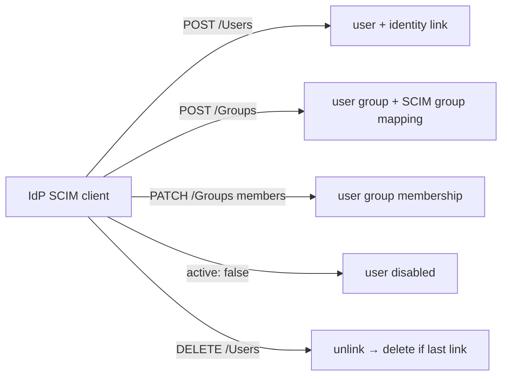

# SCIM v2 provisioning

SCIM lets your IdP (Okta, Entra ID, Keycloak, …) push users and groups into Power Manage instead of waiting for first sign-in. It complements [SSO](/concepts/sso): SSO authenticates, SCIM provisions and — critically — **de**provisions. Both paths emit the same event types the web UI does, so the audit trail is uniform regardless of where a change came from.

## Enabling SCIM on a provider

<!-- docref: begin src=server:internal/api/idp_handler.go#IDPHandler.EnableSCIM:f0c9b7c3 -->
`EnableSCIM` is a per-identity-provider switch. It generates a 32-byte random bearer token (64 hex chars), stores **only a bcrypt hash** of it, and returns the plaintext token exactly once together with the endpoint URL (`<base>/scim/v2/<slug>`). There is no way to read the token again — losing it means rotating it.
<!-- docref: end -->

<!-- docref: begin src=server:internal/api/idp_handler.go#IDPHandler.RotateSCIMToken:4c8e55f6,server:internal/api/idp_handler.go#IDPHandler.DisableSCIM:04e5db8f -->
`RotateSCIMToken` mints a fresh token the same way (again shown once, again only the hash stored), immediately invalidating the old one. `DisableSCIM` turns the endpoint off for the provider; both require SCIM to actually be enabled and fail with `FailedPrecondition` otherwise.
<!-- docref: end -->

## The endpoint surface

<!-- docref: begin src=server:internal/scim/handler.go#NewHandler:5531cee7 -->
All routes mount under `/scim/v2/{slug}/…`: discovery (`ServiceProviderConfig`, `Schemas`, `ResourceTypes`), Users (list/create/get/replace/patch/delete), and Groups (same verbs). Every route — including discovery — goes through bearer-token authentication.
<!-- docref: end -->

<!-- docref: begin src=server:internal/scim/auth.go#Handler.withAuth:5cd524d7,server:internal/scim/handler.go#Handler:a40e3cc6 -->
Authentication verifies the bearer token against the stored bcrypt hash of a SCIM-enabled, login-enabled provider. Unknown slug, SCIM-disabled provider, missing token config, and wrong token all return an **identical** 401 with a dummy bcrypt compare, so a client can't distinguish "slug exists" from "wrong token" by message or timing. Two rate-limit buckets run before the bcrypt work: 100/min per provider slug and 20/min per (slug, client IP).
<!-- docref: end -->

<!-- docref: begin src=server:internal/scim/discovery.go#Handler.serviceProviderConfig:a7f14295 -->
Discovery advertises what's actually implemented: PATCH and filtering (max 200 results) are supported; bulk operations, password sync, sorting, and ETags are not.
<!-- docref: end -->

## How SCIM maps to Power Manage objects

<!-- docref: begin src=server:internal/scim/users_create.go#Handler.createUser:21f88ec6 -->
`POST /Users` has four outcomes: an externalID that's already linked re-syncs and returns 200 (idempotent for clients that re-POST every sync cycle); with `auto_link_by_email` on, an already-linked email re-syncs (200) and an unlinked existing user gets an identity link (201); a genuinely new user is created passwordless with a derived Linux username/UID, the provider's default role, and an identity link. If the global server settings have provisioning or SSH-for-all enabled, the new user inherits those flags immediately.
<!-- docref: end -->


<!-- docref: begin src=server:internal/scim/users_create.go#Handler.createUser:21f88ec6,sdk:proto/pm/v1/control.proto#IdentityProvider.trust_email_assertions:cb24a82d -->
A SCIM client can assert any email. Auto-linking an asserted email to a pre-existing **local password** account would let a compromised or over-trusted IdP seize that account, so it is refused with `409 Conflict` unless the operator has explicitly set `trust_email_assertions: true` on the provider. See [SSO](/concepts/sso) for the full semantics of that flag.
<!-- docref: end -->


<!-- docref: begin src=server:internal/scim/users_mutate.go#Handler.replaceUser:77423f94,server:internal/scim/users_mutate.go#Handler.patchUser:73140c23 -->
`PUT` and `PATCH /Users/{id}` sync email, name fields, and the `active` flag — `active: false` disables the user (blocking login), `active: true` re-enables. Ownership is enforced first: a provider can only touch users it holds an identity link for; anything else is a 404. PATCH supports `replace` ops (add/remove are rejected with a 400).
<!-- docref: end -->

<!-- docref: begin src=server:internal/scim/groups_create.go#Handler.createGroup:c51ad8b7 -->
`POST /Groups` creates a regular Power Manage **user group** plus a SCIM group mapping (provider + SCIM group ID → user group ID). Re-POSTs are idempotent: display-name changes sync through, and a `members` array — when present — is reconciled against current membership. Members are added by user ID and only if the provider owns them.
<!-- docref: end -->

## Deprovisioning

<!-- docref: begin src=server:internal/scim/users.go#Handler.deleteUser:b258daeb -->
`DELETE /Users/{id}` first removes the provider's identity link. Only if that was the user's **last** link is the user actually deleted — a user linked to other providers (or usable via password) keeps their account. A real deletion routes through the same crypto-shred flow as an API `DeleteUser` (the user's encryption key is destroyed, redacting their event-log PII), and the user's system actions (provisioned Linux accounts, SSH grants, TTY accounts) are cleaned up from their assigned devices.
<!-- docref: end -->

<!-- docref: begin src=server:internal/scim/groups.go#Handler.deleteGroup:77a577bf -->
`DELETE /Groups/{id}` removes only the SCIM **mapping** — the underlying user group survives, with its members and role grants intact. IdP-side group deletion never cascades into deleting a group an operator may have wired into RBAC.
<!-- docref: end -->

## Provisioning toggles: what actually gets gated

Two flags share a name but gate the same thing at different granularity — whether a user's **Linux account is provisioned on their assigned devices** (the system `USER` action):

<!-- docref: begin src=server:internal/api/system_actions.go#SystemActionManager.SyncUserSystemActions:4f190bd8 -->
The system-action sync provisions a user's Linux account when `ServerSettings.user_provisioning_enabled` (global) **or** the user's own `user_provisioning_enabled` flag is set; when neither holds, existing provision actions are cleaned up. Neither flag affects SCIM or SSO account creation itself — a user can exist in Power Manage without ever materialising on a device.
<!-- docref: end -->

<!-- docref: begin src=server:internal/api/user_handler.go#UserHandler.SetUserProvisioningEnabled:b85687ce -->
`SetUserProvisioningEnabled` flips the per-user flag (scope-enforced: `:self`-scoped callers can only toggle themselves); the post-commit listener then re-syncs that user's system actions.
<!-- docref: end -->

<!-- docref: begin src=server:internal/api/settings_handler.go#SettingsHandler.UpdateServerSettings:5b01fba8,server:internal/api/settings_handler.go#SettingsHandler.enableProvisioningForAllUsers:35769eef,sdk:proto/pm/v1/control.proto#ServerSettings.user_provisioning_enabled:c92554e0 -->
The global `ServerSettings.user_provisioning_enabled` (via `UpdateServerSettings`) is additionally a **batch enable**: turning it on fans out and sets the per-user flag on every existing user. Turning the global flag off does *not* clear those per-user flags — users provisioned under the global setting stay provisioned until toggled off individually.
<!-- docref: end -->


<!-- docref: begin src=server:internal/scim/users_create.go#Handler.createUser:21f88ec6,server:internal/idp/linker.go#Linker.LinkOrCreate:da50a57c -->
Both the SCIM create path and the SSO auto-create path check the global server settings at creation time and enable per-user provisioning/SSH for the new user when the corresponding global flag is on.
<!-- docref: end -->

