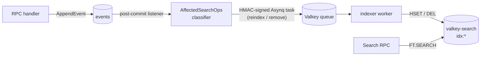

# Global search

The `Search` RPC gives the UI's omnibox and list pages one fast query surface across the whole deployment. It is served from a **valkey-search** (RediSearch-compatible) index, not from Postgres — projections stay the source of truth, the index is a denormalised, event-driven cache of them.

## What's indexed

<!-- docref: begin src=server:internal/search/index.go#IndexSchemas:407bd3f3 -->
Ten scopes, one FT index each (`idx:<scope>` over `HASH` documents keyed `search:<scope>:<id>`): **actions, action_sets, definitions, compliance_policies, devices, users, device_groups, user_groups, executions, audit_events**. Each schema declares the TEXT fields free-text search hits (name, description, hostname, email, denormalised action/set names…), TAG/NUMERIC fields for filtering, and SORTABLE fields for ordering.
<!-- docref: end -->

<!-- docref: begin src=server:internal/api/search_listener.go#loadSearchEntityData:e78a3b66 -->
Rows are denormalised so a hit renders without joins: executions carry their action name and device hostname, compliance policies the names of the actions their rules reference, devices their labels and OS/kernel inventory detail. System-managed actions (SSH/TTY/provisioning grants) are **never** indexed — the listener purges any stale entry instead of reindexing them.
<!-- docref: end -->

## How the index is maintained

<!-- docref: begin src=server:internal/api/search_listener.go#SearchListener:6555342f,server:internal/api/search_listener.go#AffectedSearchOps:c57788be -->
Maintenance is event-driven: a post-commit store listener classifies every appended event into reindex/remove operations. One event can fan out to several rows — a group-membership change reindexes the group (member count) *and* the affected user or device (its scope groups changed); an assignment change reindexes the source object's `assigned` and `scope_group_ids` tags. Listener errors are logged and swallowed (post-commit contract): a dropped enqueue means bounded drift until the next reconcile, never a failed mutation.
<!-- docref: end -->

<!-- docref: begin src=server:internal/search/worker.go#BuildSearchWorkerMux:a6dc5329,server:cmd/indexer/main.go#parseFlags:80179e19 -->
The consumer is a dedicated **indexer** binary running an Asynq worker. Every dequeued task's HMAC envelope is verified against `PM_TASK_SIGNING_KEY` — the worker refuses to start without a signer, so a compromised Valkey relay can't inject forged index updates. As a safety net for anything the event path misses, the indexer also runs a periodic full rebuild (default every hour, `-reconcile-interval` / `INDEXER_RECONCILE_INTERVAL`, `0` disables).
<!-- docref: end -->

<!-- docref: begin src=server:internal/search/index.go#Index.Rebuild:d1581510,server:internal/api/search_handler.go#SearchHandler.RebuildSearchIndex:c9621293 -->
`RebuildSearchIndex` is the admin RPC over the same full-rebuild primitive used at startup and by the periodic reconcile: flush everything, re-warm the keyspace from the Postgres projections, recreate the FT indexes, and wait for the backfill so a completed rebuild is query-ready. Concurrent rebuilds coalesce (an in-progress rebuild makes the second call a no-op).
<!-- docref: end -->

## Search RPC semantics

<!-- docref: begin src=server:internal/api/search_handler.go#SearchHandler.Search:dc340596 -->
A request carries a free-text `query`, an optional `scope` (UNSPECIFIED fans out across the eight object/entity scopes — executions and audit events must be queried explicitly), `page_size` (anything outside [1, 200] falls back to the default 50), a `page_token` (a plain result offset, capped at 100 000), plus date-range and tag filters and a sort. An entirely empty request returns an empty response rather than dumping the catalog.
<!-- docref: end -->

<!-- docref: begin src=server:internal/api/search_handler.go#buildFTQuery:0983b3f4,server:internal/api/search_handler.go#escapeRediSearch:c63b1413 -->
The text query becomes an escaped prefix search (`term*`); date filters become `@field:[start end]` ranges; tag filters become `@field:{a|b}` clauses (pipe = OR), with NUMERIC fields translated to exact ranges instead. Every user-supplied string is escaped against the full RediSearch metacharacter set (backslash first), so query syntax can't be injected through the search box.
<!-- docref: end -->

<!-- docref: begin src=server:internal/api/search_handler.go#validateFiltersForScopes:8daa0267,server:internal/api/search_handler.go#resolveSort:09a40266,server:internal/api/search_handler.go#deviceStatusClause:80e815f4 -->
Filters and sorts are validated up front against what each index actually declares: a filter field unsupported by any scope in the query plan is rejected with `InvalidArgument` naming the scopes that do support it, and a sort field must be SORTABLE on the requested scope. The device `status` filter is synthetic — `online`/`offline` translate to a `last_seen_at` range using the same 5-minute window as the Postgres offline query.
<!-- docref: end -->

<!-- docref: begin src=server:internal/api/search_handler.go#parseFTSearchResult:b1160c51 -->
Results come back with the entity `id`, its `scope`, convenience top-level fields (`name` — hostname for devices, email for users — `description`, `member_count`), and the full indexed hash in the `fields` map. `total_count` and `next_page_token` drive pagination.
<!-- docref: end -->

<!-- docref: begin src=server:internal/auth/permissions.go#AllPermissions:665a1b03,server:internal/auth/interceptor.go#AuthzInterceptor.WrapUnary:b29794e8,server:internal/auth/interceptor.go#isExpensiveProcedure:bc05a794 -->
`Search` and `RebuildSearchIndex` are each gated by the permission of the same name (the authz interceptor authorizes by RPC name), and both fall into the "expensive procedure" class that gets a tighter per-user rate ceiling than ordinary reads.
<!-- docref: end -->

## Scope parity: search can't see more than you can

Search results honour the caller's visibility scopes — a scoped admin gets the same subset from the omnibox as from the list pages.

<!-- docref: begin src=server:internal/api/search_handler.go#scopeGroupClause:6ef8505b,server:internal/search/index.go#ScopeGroupField:9e4299b1 -->
Every scoped index row carries a server-only `scope_group_ids` TAG holding the device-/user-group IDs the object is assigned to (for devices/users: the groups they belong to). For a scope-restricted caller, the handler appends a confining clause per scope — devices mirror the caller's `ListDevices` device-group scope, users the `ListUsers` user-group scope, and the four object scopes (actions, action sets, definitions, compliance policies) the caller's union object scope. The scope comes straight from the JWT; no extra DB round-trip. Unrestricted (global) admins get no clause.
<!-- docref: end -->

<!-- docref: begin src=server:internal/api/search_handler.go#noScopeSentinel:ca958a02,server:internal/api/search_listener.go#loadScopeGroupIDs:142afdcb -->
The confinement fails closed at both ends: a restricted caller with zero resolvable scope groups gets a clause matching a sentinel value no real object carries (empty result, never the whole catalog), and an object with no assignments indexes an empty `scope_group_ids` TAG, keeping it invisible to every scoped caller.
<!-- docref: end -->


<!-- docref: begin src=server:internal/api/object_scope_parity_test.go#TestObjectScope_EnforcementMatchesIndexFiltering:a5c3110c,server:internal/api/scope_group_clause_test.go#TestScopeGroupClause:74403dde,server:internal/api/search_scope_parity_test.go#TestScopeFilterFields_MirrorIndexSchemas:a41ac96d -->
An AST-scanning test asserts that the object types enforced at the handler boundary are exactly the search scopes whose index declares `scope_group_ids` — if they diverge, either a Get leaks an object search hides, or Search leaks a catalog the handlers protect. A second test pins the per-scope confinement clauses, and a third keeps the client-facing filter allow-list in lockstep with the index schemas while asserting `scope_group_ids` is never exposed as a client filter.
<!-- docref: end -->



<!-- docref: begin src=server:internal/api/search_listener.go#SearchListener:6555342f -->
The index trails the event store by an async enqueue + worker hop (normally milliseconds). If an enqueue is lost, drift is bounded by the indexer's periodic reconcile — worst case about an hour at the default interval. Point lookups and list pages read Postgres projections and are never stale in this way.
<!-- docref: end -->

