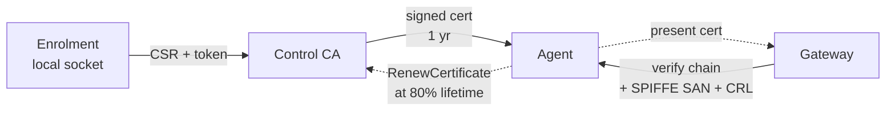

# mTLS and signed actions

<!-- docref: begin src=server:internal/mtls/mtls.go#NewTLSConfig:4e33a1ed,server:internal/handler/agent.go#MTLSMiddleware:c507fa5e -->
mTLS terminates at the gateway. Every agent presents a CA-signed client certificate. The gateway requires it at the TLS layer (`tls.RequireAndVerifyClientCert`, TLS 1.3 minimum) and then, per request, enforces a SPIFFE URI SAN check that pins the peer's class plus a fail-closed revocation check against the CRL.
<!-- docref: end -->

<!-- docref: begin src=server:internal/mtls/peer_class.go#PeerClass:77f6d11b,server:internal/mtls/peer_class.go#RequirePeerClassNotRevoked:a56afe56 -->
The peer classes are `spiffe://power-manage/<class>` URI SANs: `agent` for device agents, `gateway` and `control` for the inter-service mTLS the `InternalService` proxy uses. Each listener requires a specific class, so a leaked cert of one class (an agent cert pulled from a compromised host) cannot reach a listener intended for another class — and the internal listeners additionally reject revoked gateway/control certs at connect time.
<!-- docref: end -->



## Certificate lifecycle

| Stage | What happens |
|---|---|
| Enrolment | The agent generates a key, sends a CSR through the local `enroll.sock` Unix socket gated by a registration token. The control server signs a cert valid for **1 year** by default. |
| Steady state | The agent presents the cert on every gateway connection. The gateway verifies the chain, the SPIFFE SAN, and the revocation list. |
| Renewal | At **80% of cert lifetime** (~292 days in), the agent calls `RenewCertificate` on the control server. The control server validates the presented cert's fingerprint against the DB, demands proof-of-possession, issues a new cert, and revokes the superseded one. |
| Revocation | A Valkey-backed CRL shared by control (writer) and gateways (cached readers). Deleting a device revokes its cert; renewing a cert revokes the superseded one. The gateway's per-connection check is fail-closed. |

<!-- docref: begin src=server:internal/ca/ca.go#CA.IssueCertificateFromCSR:e62c3adb,server:cmd/control/flags.go#parseFlags:d739daf2 -->
The issued cert's validity defaults to 8760 hours (1 year, the `-cert-validity` flag on the control server). The CA signs only the CSR's public key — the private key never leaves the agent — and refuses any CSR that requests Subject Alternative Names, so a malicious agent can't mint a cert carrying internal hostnames. The device ID lands in the Subject CN, and the CA stamps the `agent` SPIFFE peer-class URI SAN itself.
<!-- docref: end -->

### Renewal, in detail

<!-- docref: begin src=agent:cmd/power-manage-agent/cert_rotation.go#renewAt:211ccaeb,agent:cmd/power-manage-agent/cert_rotation.go#startCertRotation:81135da7 -->
The agent drives its own renewal: a background loop computes 80% of the cert's lifetime and calls `RenewCertificate` at that point, retrying hourly on failure (with escalating log volume so a stalled rotation is visible in `journalctl`).
<!-- docref: end -->

<!-- docref: begin src=server:internal/api/certificate_handler.go#CertificateHandler.renewLocked:9f5fb368,server:internal/ca/ca.go#AssertCSRMatchesCertKey:1b048009 -->
Server-side, the renewal is not just "any valid cert gets a new one": the presented cert's fingerprint is compared against the device's stored fingerprint in constant time (a superseded or revoked cert is refused), and the CSR must carry the **same public key** as the current cert (proof-of-possession — certs are public material, so without this check anyone holding a device's cert PEM could renew it onto a key they control). Concurrent renewals for one device are serialized under a per-device advisory lock.
<!-- docref: end -->

<!-- docref: begin src=sdk:client.go#WithMTLSFromPEMAndSystemRoots:0388329a -->
`RenewCertificate` is a `ControlService` RPC — it travels over the control server's public HTTPS endpoint (typically Traefik with a Let's Encrypt cert), not over the agent↔gateway mTLS channel. The agent's identity proof is the current certificate in the request body plus the matching-key CSR, not the transport.
<!-- docref: end -->

### Revocation

<!-- docref: begin src=server:internal/crl/crl.go#Store.Revoke:17984417,server:internal/api/device_handler.go#DeviceHandler.DeleteDevice:d74b7e3f,server:internal/api/certificate_handler.go#CertificateHandler.renewLocked:9f5fb368 -->
Per-fingerprint revocation is implemented as a Valkey-backed CRL. Two paths write to it: `DeleteDevice` revokes the deleted device's cert (otherwise it would keep connecting until its 1-year expiry), and every renewal revokes the superseded cert. Entries carry the revoked cert's own expiry and age out on their own. There is no standalone `RevokeCertificate` RPC — revocation rides device deletion and renewal.
<!-- docref: end -->

<!-- docref: begin src=server:cmd/gateway/main.go#loadInitialCRL:e41a48d5,server:internal/crl/crl.go#Cache:7fdc8bfa -->
The gateway caches the CRL in memory and checks each connection's cert fingerprint against the snapshot — no per-connection RPC. The cache is **fail-closed**: the gateway refuses to boot if the initial CRL load fails, and a not-yet-loaded cache rejects connections ("cannot prove this cert is unrevoked") rather than admitting them. A refresh error keeps the previous snapshot (fail-static), so a transient Valkey outage never silently drops enforcement.
<!-- docref: end -->

## One CA root

<!-- docref: begin src=server:cmd/control/flags.go#applyEnvOverrides:41b51197,server:internal/ca/ca.go#CA.SetTrustBundle:89b525aa -->
Today there is **one** CA root in play, configured through `CONTROL_CA_CERT` / `CONTROL_CA_KEY`. The same CA signs the agent client certs *and* the gateway / control server certs used for the inter-service `InternalService` mTLS (separated by SPIFFE peer class, not by CA). The HTTPS cert on the Traefik edge is independent (your own issuer or Let's Encrypt). For rotation, `CONTROL_CA_TRUST_BUNDLE` can point the control server's *verification* pool at a PEM containing multiple CA certs while `CONTROL_CA_KEY` keeps signing — see [CA rotation](/security/ca-rotation).
<!-- docref: end -->

## Signed actions

On top of mTLS, every dispatched action carries a CA signature over the **full action envelope** — not just an ID/type/params digest. The signed message is the deterministic protobuf wire encoding of `SignedActionEnvelope`:

```proto docref=sdk:proto/pm/v1/actions.proto#SignedActionEnvelope:05aac70b
message SignedActionEnvelope {
  // Execution id this envelope authorizes (the wire ActionId.value).
  ActionId action_id = 1;
  ActionType action_type = 2;
  DesiredState desired_state = 3;
  int32 timeout_seconds = 4;
  ActionSchedule schedule = 5;
  // The single device this envelope is authorized to run on.
  string target_device_id = 6;

  // Type-specific parameters — the same param message types as Action,
  // re-declared here so the signed bytes carry exactly what executes.
  oneof params {
    PackageParams package = 7;
    AppInstallParams app = 8;
    ShellParams shell = 9;
    ServiceParams service = 10;
    FileParams file = 11;
    UpdateParams update = 12;
    RepositoryParams repository = 13;
    FlatpakParams flatpak = 14;
    DirectoryParams directory = 15;
    UserParams user = 16;
    SshParams ssh = 17;
    SshdParams sshd = 18;
    AdminPolicyParams admin_policy = 19;
    LpsParams lps = 20;
    GroupParams group = 21;
    EncryptionParams encryption = 22;
    WifiParams wifi = 23;
    AgentUpdateParams agent_update = 24;
  }
}
```

<!-- docref: begin src=server:internal/actionparams/sign_envelope.go#BuildAndSignEnvelope:ae868e64,sdk:verify/verify.go#ActionSigner.Sign:78ac99b3,agent:internal/executor/executor.go#Executor.VerifyEnvelope:ea44180f -->
Every dispatch path funnels through a single signing site on the control server, and every execution path on the agent funnels through a single verify-then-unmarshal seam: the agent verifies the CA signature over the **exact bytes it received** and, on success, unmarshals those same bytes to execute — so the executed message is byte-for-byte the signed message. Because the whole envelope is bound, a compromised gateway or Valkey relay cannot flip `desired_state`, swap params, change the timeout or schedule, lift the type onto `SYNC`, or retarget the device under a still-valid signature.
<!-- docref: end -->

<!-- docref: begin src=sdk:verify/verify.go#ActionSignatureDomain:fe438abc,sdk:verify/verify.go#canonicalDigest:8e724a35 -->
The signature pre-image is `SHA-256(len32(domain) || domain || envelopeBytes)` with the domain tag `power-manage-action`. Non-action stream RPCs that also run as root on the agent — osquery, log queries, LUKS key revocation, inventory requests, and the LPS sealing public key — are signed under their **own** domain tags, so a signature minted for one surface can never be replayed against another.
<!-- docref: end -->

<!-- docref: begin src=sdk:verify/verify.go#ActionVerifier.verifyDigest:5f7ba25f,server:internal/ca/ca.go#NewFromPEM:2da06d00 -->
Algorithm is **ECDSA (ASN.1) or RSA PKCS#1 v1.5, both with SHA-256**, picked from the CA key's type; Ed25519 (and anything else) is explicitly refused by the verifier, and the control server refuses to boot with a signer-incompatible CA key rather than silently produce unverifiable dispatches.
<!-- docref: end -->

<!-- docref: begin src=agent:internal/handler/handler.go#Handler.OnActionWithStreaming:06e9eebb -->
Instant actions (`REBOOT`, `SYNC`) are signed too — the type is bound inside the verified envelope, so a signature minted for a non-`SYNC` action cannot be lifted onto a `SYNC` dispatch. If the signature doesn't verify, nothing is stored, synced, or executed: the agent returns a `FAILED` result carrying the verification error ("refusing to execute unsigned/tampered action"), which lands in the audit log as an `ExecutionFailed` event — a forgery attempt leaves a trace.
<!-- docref: end -->

- **Terminal session start is *not* an action and is *not* CA-signed.** It rides the agent's stream as a separate message; the gateway validates the session's bearer token against the control server, and the agent's local TTY enable flag is what gates it — see [Remote terminal access](/security/terminal-access).

## The checks on a dispatch, in order

For every dispatch on the path control → Valkey → gateway → agent:

<!-- docref: begin src=sdk:client.go#WithMTLSFromPEM:7e7dc2c3 -->
1. **TLS, both ways.** The agent verifies the gateway's server cert **strictly against the internal CA it enrolled with** — system roots are not consulted, so a cert signed by any public CA cannot impersonate the gateway even with a matching SNI. The gateway requires and verifies the agent's client cert.
<!-- docref: end -->
2. **Peer class + revocation at the gateway.** The agent cert must carry the `agent` SPIFFE class and must not be on the CRL (fail-closed if the CRL hasn't loaded).
<!-- docref: begin src=server:internal/taskqueue/sign.go#Signer.VerifyMiddleware:8511fb71 -->
3. **Envelope HMAC at the gateway worker.** The Asynq task-signing key check (see [Asynq task signing](/security/task-signing)) catches Valkey tampering before the gateway forwards anything to the stream.
<!-- docref: end -->
4. **Action signature at the agent.** The full-envelope CA signature, verified fail-closed before any side effect.
5. **Typed params.** What executes is read exclusively off the verified envelope's typed `oneof` — there is no separate advisory params field to desync.

A failure at any layer ends the dispatch and surfaces as an event or a log line. No silent drops.

## Trust-bundle reloads

<!-- docref: begin src=server:internal/ca/ca.go#CA.SetTrustBundle:89b525aa -->
`SetTrustBundle` accepts a PEM with multiple CA certs, which is the mechanism behind the documented [root CA rotation](/security/ca-rotation) flow: during the window, agent certs signed by either root verify. Picking up a new bundle requires `docker compose restart control gateway` so both processes re-read the on-disk material — there is **no SIGHUP-style live reload**.
<!-- docref: end -->

<!-- docref: begin src=sdk:crypto/cert.go#VerifyCAContinuity:30b656cc,agent:cmd/power-manage-agent/cert_rotation.go#applyRenewal:49ccae95 -->
Agents adopt a new CA only through renewal, and only when the new CA **chains to the one they enrolled with**: the renewal response's CA must be byte-identical to the enrolled CA or cross-signed by it. An unrelated root is refused as a trust-anchor swap and the agent keeps its existing cert + CA — a hard CA swap requires re-enrolment, by design. There is also **no admin-initiated force-renew RPC**; the agent's 80%-lifetime tick is the only renewal driver.
<!-- docref: end -->
