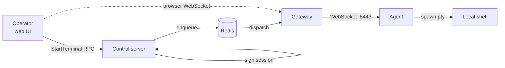

# Remote terminal access

The agent can open an interactive shell to authorised operators through the control server. The tool you reach for when an action's audit trail isn't enough and you need to actually look at the box.

The trust model leans toward the device. The agent decides whether *terminal* access is allowed at all. The TTY enable flag is enforced locally by the agent, so the gateway can't open a session against a device whose flag is off.

> **Caveat: "terminal access disabled" is not the same as "remote root access disabled."** An operator with `DispatchAction` permission can run any [`SHELL`](/action-reference/system/shell) or [`SCRIPT_RUN`](/action-reference/system/script-run) script as root, including using `detection_script` as a structured way to read state back. Earlier agent code tried to gate the `tty enable` command on being invoked from an interactive TTY, but that turned out to be defeatable in one line (`script(1)` allocates a PTY), so the gate was dropped on purpose. The TTY enable flag is what prevents an *interactive* session — RBAC over `DispatchAction` is what prevents the equivalent via a script. Treat them as two doors, both of which need to be closed.

> **Today this is a web-UI-only feature.** `StartTerminal` returns a session token and a gateway WebSocket URL designed for the browser client. There is no `power-manage-agent terminal open` (or equivalent) CLI driver. Calling `StartTerminal` from curl gets you the token and URL but no shell — you need a WebSocket-aware client to actually use the session. Building a CLI driver is on the longer-tail backlog, not in 2026.06 / 07.

## Enabling terminal access on a device

Terminal access is **disabled by default**. To turn it on, sign in to the device as a local administrator and run:

```bash
sudo power-manage-agent tty enable
```

This sets `tty.enabled` in the agent's local SQLite settings store (`/var/lib/power-manage-agent/agent.db`). Until that row is `true`, the agent rejects any session-start request, regardless of who is asking. The agent enforces this locally; the server cannot override it for the *terminal* path (see the caveat at the top of the page about the script-action path).

To turn it back off:

```bash
sudo power-manage-agent tty disable
```

## The session flow



1. The operator clicks **Terminal** on a device page in the web UI.
2. The web UI calls `StartTerminal` on the control server.
3. The control server checks the operator's permission (`StartTerminal` is a discrete RBAC permission, granted via roles), signs a session token, and dispatches it to the agent.
4. The agent verifies the signature, checks its local enable flag, spawns a PTY, and reports the WebSocket endpoint.
5. The operator's browser opens a WebSocket directly to the gateway's `:8443` endpoint, authenticated with `Sec-WebSocket-Protocol` carrying the session bearer.
6. Bytes flow in both directions through the gateway, end-to-end mTLS to the agent.

All session creation, attach, detach, and termination events get recorded in the audit log.

## Permissions

Four RBAC permissions cover the terminal lifecycle:

| Permission | What it grants |
|---|---|
| `StartTerminal` | Open a new terminal session against a device |
| `StopTerminal` | End your own session early |
| `ListActiveTerminalSessions` | See every open session in the fleet |
| `TerminateTerminalSession` | Force-end someone else's session (admin override) |

A scoped `StartTerminal:assigned` variant restricts you to devices you've been assigned. Use it for support engineers who shouldn't see the whole fleet.

Build the role from those permissions yourself via `CreateRole` (or the web UI's **Roles** → **Create role**). There are no preset terminal-admin roles seeded by default. The granularity is intentional, since "can start a session" and "can kill someone else's session" usually belong to different operators.

## What's recorded

Only the operator's **input** stream is captured. The gateway tees stdin frames into the audit batcher (coalesced into ~4 KiB / 1 s chunks); the agent's output stream is forwarded straight to the operator's browser without being copied to the audit pipeline. The audit log shows:

- Session start: operator, device, signed token id
- Session attach / detach: WebSocket connect / disconnect timestamps
- Session input: everything the operator typed, per coalesced chunk
- Session end: who closed it (operator, agent, force-terminated)

What you do **not** get in the audit log:

- The shell's response, command output, file contents on screen, etc.
- The output of an `:!sh` escape from inside `vi`, or any sub-shell.
- The exit code or duration of an interactive command.

Practically: an operator types `cat /etc/shadow` — the audit log has `cat /etc/shadow`, but **not** the contents of `/etc/shadow`. The two design reasons are: terminal output ranges from "binary stream from `htop`" to "10 MB of `cat largefile`" and is brittle to record faithfully; and the audit log is meant for *who did what*, not session screenscraping. If you need output retention, log into the device via SSH with a session recorder (`sudo`'s `iolog`, `tlog`, etc.) — that's the right layer.

Redaction is **not** automatic on the input side either. Pasting a secret as a command argument lands in the audit log verbatim.
