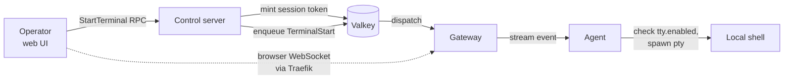

# Remote terminal access

The agent can open an interactive shell to authorised operators through the control server. The tool you reach for when an action's audit trail isn't enough and you need to actually look at the box.

<!-- docref: begin src=agent:internal/store/tty.go#Store.IsTTYEnabled:69534a57,agent:internal/handler/terminal.go#Handler.OnTerminalStart:282ad6f8 -->
The trust model leans toward the device. The agent decides whether *terminal* access is allowed at all. The TTY enable flag is enforced locally by the agent on every session-start request, so the gateway can't open a session against a device whose flag is off.
<!-- docref: end -->

<!-- docref: begin src=agent:cmd/power-manage-agent/cmd_tty.go#runTTY:4075ab09 -->
> **Caveat: "terminal access disabled" is not the same as "remote root access disabled."** An operator with `DispatchAction` permission can run any [`SHELL`](/action-reference/system/shell) or [`SCRIPT_RUN`](/action-reference/system/script-run) script as root, including using `detection_script` as a structured way to read state back. Earlier agent code tried to gate the `tty enable` command on being invoked from an interactive TTY, but that turned out to be defeatable in one line (`script(1)` allocates a PTY), so the gate was dropped on purpose — the command now requires root instead. The TTY enable flag is what prevents an *interactive* session — RBAC over `DispatchAction` is what prevents the equivalent via a script. Treat them as two doors, both of which need to be closed.
<!-- docref: end -->

> **Today this is a web-UI-only feature.** `StartTerminal` returns a session ID, a short-lived bearer token, and a gateway WebSocket URL designed for the browser client. There is no `power-manage-agent terminal open` (or equivalent) CLI driver. Calling `StartTerminal` from curl gets you the token and URL but no shell — you need a WebSocket-aware client to actually use the session. Building a CLI driver is on the longer-tail backlog.

## Enabling terminal access on a device

Terminal access is **disabled by default**. To turn it on, sign in to the device as a local administrator and run:

```bash
sudo power-manage-agent tty enable
```

<!-- docref: begin src=agent:internal/store/tty.go#TTYSettingKey:c0e8939a -->
This sets `tty.enabled` in the agent's local SQLite settings store (`/var/lib/power-manage/agent.db`). Until that row is `true`, the agent rejects any session-start request, regardless of who is asking. The agent enforces this locally; the server cannot override it for the *terminal* path (see the caveat at the top of the page about the script-action path).
<!-- docref: end -->

To turn it back off:

```bash
sudo power-manage-agent tty disable
```

## The session flow


```mermaid
flowchart LR
    Operator[Operator<br/>web UI] -->|StartTerminal RPC| Control[Control server]
    Control -->|mint session token| Valkey[(Valkey)]
    Control -->|enqueue TerminalStart| Valkey
    Valkey -->|dispatch| Gateway[Gateway]
    Gateway -->|stream event| Agent[Agent]
    Agent -->|check tty.enabled,<br/>spawn pty| Shell[Local shell]
    Operator -.->|browser WebSocket<br/>via Traefik| Gateway
```

1. The operator clicks **Terminal** on a device page in the web UI.
2. The web UI calls `StartTerminal` on the control server.
<!-- docref: begin src=server:internal/api/terminal_handler.go#TerminalHandler.StartTerminal:ec35c7b4 -->
3. The control server checks the operator's permission (`StartTerminal` is a discrete RBAC permission, granted via roles — a device-group-scoped grant is enforced here too), requires the operator to have a `linux_username` configured (that becomes the TTY user inside the session), resolves which gateway currently holds the device's stream, emits the audit event, and mints the session token.
<!-- docref: end -->
<!-- docref: begin src=server:internal/terminal/store.go#TokenStore.MintWithID:42f7f758,server:internal/terminal/store.go#DefaultTokenTTL:f1d65ff7 -->
4. The session token is a 32-byte random bearer, stored **hashed** in Valkey with a **60-second TTL** — it authorises one WebSocket attach shortly after the RPC, not a durable credential.
<!-- docref: end -->
5. The agent receives the `TerminalStart` event over its stream, checks its local enable flag, and spawns a PTY. The session start is **not** CA-signed like an action — the local flag plus the gateway-validated token are the gates.
<!-- docref: begin src=server:internal/handler/terminal_bridge.go#extractTerminalToken:99cb49ab,server:internal/handler/terminal_bridge.go#terminalSubprotocolPrefix:0882b22b -->
6. The operator's browser opens a WebSocket to the gateway's terminal endpoint (public TLS terminates at Traefik, on the dedicated TTY hostname). The bearer token travels in the `Sec-WebSocket-Protocol` header as `bearer.<token>` — a token passed as a `?token=` query parameter is hard-rejected, because query strings leak into proxy access logs, Referer headers, and devtools.
<!-- docref: end -->
<!-- docref: begin src=server:internal/terminal/store.go#TokenStore.Validate:3a0c8f0f,sdk:proto/pm/v1/internal.proto#InternalService.ProxyValidateTerminalToken:ec8abfcb -->
7. The gateway does not trust the token on sight: it validates it against the control server (constant-time compare against the stored hash, expiry checked) before bridging any bytes to the agent.
<!-- docref: end -->

Session start, stop, and force-termination are recorded in the audit log, along with every input chunk.

## Permissions

Six RBAC permissions cover the terminal feature:

<!-- docref: begin src=server:internal/auth/permissions.go#AllPermissions:665a1b03 -->
| Permission | What it grants |
|---|---|
| `StartTerminal` | Open a new terminal session against a device |
| `StopTerminal` | End your own session early |
| `ListActiveTerminalSessions` | See every open session in the fleet |
| `TerminateTerminalSession` | Force-end someone else's session (admin override) |
| `TerminalAdminLimited` | A passwordless *limited* sudoers policy inside sessions on the granted devices |
| `TerminalAdminFull` | A passwordless *full* sudoers policy inside sessions on the granted devices |

All six are device-targeted, so a role can grant them scoped to a device group. A caller who holds only scoped (assigned-devices) access to `StartTerminal` can open sessions only on devices assigned to them — out-of-scope devices are refused. There is no preset terminal-admin role seeded by default; build the role from those permissions yourself via `CreateRole` (or the web UI's **Roles** → **Create role**). The granularity is intentional, since "can start a session" and "can kill someone else's session" usually belong to different operators.
<!-- docref: end -->

## What's recorded

<!-- docref: begin src=server:internal/handler/terminal_audit_batcher.go#newTerminalAuditBatcher:79a256b8,server:internal/taskqueue/types.go#TypeTerminalAuditChunk:49cfe3ee -->
Only the operator's **input** stream is captured. The gateway tees stdin frames into an audit batcher (coalesced into 4 KiB / 1 s chunks and shipped to the control server on a dedicated serial queue); the agent's output stream is forwarded straight to the operator's browser without being copied to the audit pipeline.
<!-- docref: end -->

The audit log shows:

<!-- docref: begin src=server:internal/eventtypes/types.go#TerminalSessionStarted:f3b5b093,server:internal/eventtypes/types.go#TerminalSessionStopped:f3b5b093,server:internal/eventtypes/types.go#TerminalSessionTerminated:f3b5b093 -->
- Session start (`TerminalSessionStarted`): operator, device, session ID
- Session input: everything the operator typed, per coalesced chunk
- Session end: stopped by the operator (`TerminalSessionStopped`) or force-terminated by an admin (`TerminalSessionTerminated`)
<!-- docref: end -->

What you do **not** get in the audit log:

- The shell's response, command output, file contents on screen, etc.
- The output of an `:!sh` escape from inside `vi`, or any sub-shell.
- The exit code or duration of an interactive command.

Practically: an operator types `cat /etc/shadow` — the audit log has `cat /etc/shadow`, but **not** the contents of `/etc/shadow`. The two design reasons are: terminal output ranges from "binary stream from `htop`" to "10 MB of `cat largefile`" and is brittle to record faithfully; and the audit log is meant for *who did what*, not session screenscraping. If you need output retention, log into the device via SSH with a session recorder (`sudo`'s `iolog`, `tlog`, etc.) — that's the right layer.

Redaction is **not** automatic on the input side either. Pasting a secret as a command argument lands in the audit log verbatim.
