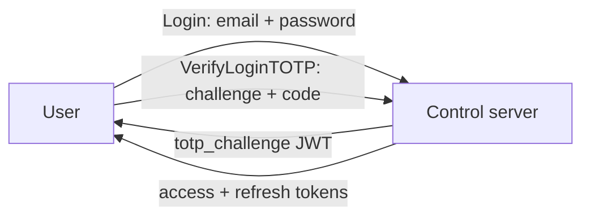

# Two-factor authentication (TOTP)

Password accounts can add a second factor: standard TOTP (the 6-digit authenticator-app codes), plus a set of single-use backup codes. 2FA is per-user and opt-in; there is no tenant-wide "force 2FA" switch today.

SSO accounts don't get TOTP here — federated users are expected to bring their identity provider's MFA. The setup, disable, and regenerate RPCs all refuse accounts without a local password.

## The login flow with TOTP enabled

<!-- docref: begin src=server:internal/api/auth_handler.go#AuthHandler.Login:b6a2875a,server:internal/auth/jwt.go#JWTManager.GenerateTOTPChallenge:7ef7b5bf -->
When a TOTP-enabled user passes the password step, `Login` does **not** return session tokens. It returns a `totp_challenge` — a short-lived (5-minute) JWT bound to the user and their session version — and the client must complete `VerifyLoginTOTP` with that challenge plus a code to get real tokens.
<!-- docref: end -->

<!-- docref: begin src=server:internal/api/totp_handler.go#TOTPHandler.VerifyLoginTOTP:778e8c47,server:internal/api/totp_handler.go#TOTPHandler:76b4541c -->
The challenge is **single-use**: it is consumed by its JWT ID the moment it validates, so one password step buys exactly one TOTP guess. Presenting the same challenge again — even with a *correct* code — is rejected, and the user has to go back through the (IP-rate-limited) password step. Without this, the challenge JWT would be replayable for its full 5-minute life, i.e. unlimited TOTP guesses per password.
<!-- docref: end -->

<!-- docref: begin src=server:internal/api/totp_handler.go#totpAccountFailLimit:fe1c0170 -->
On top of the single-use challenge there's a per-*account* ceiling: at most 10 failed `VerifyLoginTOTP` attempts per account in 15 minutes, independent of source IP — so rotating IPs doesn't buy an attacker more guesses against one targeted account.
<!-- docref: end -->

A successful second factor also re-checks that the account is still enabled and the session version hasn't been bumped since the password step, then mints tokens and records the `UserLoggedIn` audit event.

## Setting it up

Two RPCs, in order:

<!-- docref: begin src=server:internal/api/totp_handler.go#TOTPHandler.SetupTOTP:2c3f399c -->
1. **`SetupTOTP`** generates the secret and the backup codes. The response carries the secret, an `otpauth://` QR URI for authenticator apps, and the plaintext backup codes — the **only** time any of them is shown. At rest the secret is AES-GCM-encrypted under `CONTROL_ENCRYPTION_KEY` and the backup codes are stored as bcrypt hashes. SSO-only accounts are refused at this step.
<!-- docref: end -->
<!-- docref: begin src=server:internal/api/totp_handler.go#TOTPHandler.VerifyTOTP:c9c53b5e -->
2. **`VerifyTOTP`** confirms the setup by validating one code from the app. Only then is TOTP *enabled* — an initiated-but-unverified setup never gates login. Calling it again once enabled is refused.
<!-- docref: end -->

`GetTOTPStatus` tells a signed-in user whether TOTP is on and how many backup codes remain.
<!-- docref: begin src=server:internal/api/totp_handler.go#TOTPHandler.GetTOTPStatus:323ff5e8 -->
A user who never set TOTP up gets `enabled: false` rather than an error.
<!-- docref: end -->

## Backup codes

<!-- docref: begin src=server:internal/auth/totp/backup.go#GenerateBackupCodes:5e93cc57,server:internal/auth/totp/backup.go#BackupCodeCount:4daf9586 -->
Setup (and every regeneration) produces **10 codes**, each 16 hex chars (64 bits of `crypto/rand` entropy), stored bcrypt-hashed at the same cost factor as account passwords — a leaked backup-code hash is no cheaper to grind offline than a leaked password hash.
<!-- docref: end -->

At login, a code that isn't a valid 6-digit TOTP is tried against the unused backup codes.

<!-- docref: begin src=server:internal/api/totp_handler.go#TOTPHandler.VerifyLoginTOTP:778e8c47,server:internal/store/migrations/002_event_store.sql:66e18472 -->
Each backup code is consumed **exactly once**, race-free: the consume is an event append with an expected stream version, so two concurrent logins presenting the same code both pass the in-memory check but only one append lands — the event store's `UNIQUE (stream_type, stream_id, stream_version)` constraint serialises them, and the loser re-reads, sees the code marked used, and gets "invalid TOTP code". Concurrency can't double-spend a backup code.
<!-- docref: end -->

<!-- docref: begin src=server:internal/api/totp_handler.go#TOTPHandler.RegenerateBackupCodes:00a7385a -->
**`RegenerateBackupCodes`** mints a fresh set of 10 (shown once) and invalidates the old set. It requires the account **password**, not just a valid session — a hijacked browser session can't silently rotate the codes.
<!-- docref: end -->

## Disabling

<!-- docref: begin src=server:internal/api/totp_handler.go#TOTPHandler.DisableTOTP:b0a091b2 -->
**Self-service:** `DisableTOTP` requires the account password (again: a live session alone isn't enough) and refuses SSO-only accounts.
<!-- docref: end -->

<!-- docref: begin src=server:internal/api/totp_handler.go#TOTPHandler.AdminDisableUserTOTP:20a3a8f4 -->
**Admin reset:** `AdminDisableUserTOTP` is the lost-phone path — a discrete RBAC permission (scope-checked against the target user), no password required. The audit event records the acting admin as the actor and flags the payload with `admin: true`, so a self-disable and an admin reset are distinguishable in the log.
<!-- docref: end -->

There is no admin *setup* path: an admin can remove a user's second factor, never add or read one.

## What lands in the audit log

<!-- docref: begin src=server:internal/eventtypes/types.go#TOTPSetupInitiated:6678853b,server:internal/api/audit_handler.go#eventRedactionSchemas:5e97c281 -->
Every TOTP state change is an event: `TOTPSetupInitiated`, `TOTPVerified`, `TOTPDisabled`, `TOTPBackupCodeUsed` (with the code's index, not the code), and `TOTPBackupCodesRegenerated`. The secret-bearing fields — the encrypted TOTP secret and the backup-code bcrypt hashes — are redacted when events are read back through `ListAuditEvents`, the same schema-aware redaction the rest of the [audit log](/security/audit-log) uses.
<!-- docref: end -->
