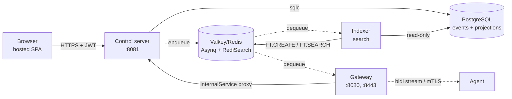

# power-manage-server

## Overview

The server component consists of three Go services — **control**, **gateway**,
and **indexer** — plus a Postgres event store and a Valkey/Redis instance for
Asynq task queues and RediSearch indexing. Together they form the backend of
the power-manage device management platform.

## Architecture diagram

## Components

### Control server (`server/cmd/control/`)

The control server is the **only component that writes to Postgres**. Every
state change flows through its `AppendEvent` path. It hosts:

- **Connect-RPC `ControlService`** on `:8081` (HTTPS + JWT) — 164 RPCs
  covering users, devices, actions, assignments, groups, identity providers,
  SCIM, TOTP, compliance policies, audit log, and search.
- **OIDC callback** for SSO sign-in (authorization code flow, token exchange,
  user linking).
- **SCIM v2 endpoint** at `/scim/v2/{slug}/` for automated user and group
  provisioning from identity providers.
- **Internal mTLS-protected `InternalService`** on `:8082` — the gateway
  proxies credential-bearing operations through this (LUKS key retrieval,
  LPS password storage, terminal token validation, device verification).

### Gateway (`server/cmd/gateway/`)

The gateway terminates agent mTLS connections. It has **no database** and holds
**no credentials**. Key functions:

- **Bidirectional Connect-RPC stream** on `:8080` — agents connect here,
  receive action dispatches, and report execution results.
- **Remote terminal WebSocket** on `:8443` — operator terminal sessions
  proxied through the gateway to the agent.
- **Asynq workers** — per-device task queues for action dispatch.
  HMAC-signed envelopes prevent a compromised Redis from forging tasks.
- **Multi-gateway topology** — gateways self-register in Redis; Traefik
  routes by SNI to the gateway holding an agent's current stream.

### Indexer (`server/cmd/indexer/`)

A read-only background service that reconciles Postgres event data into
RediSearch indexes for full-text search across the web UI.

## Event sourcing model

All state changes are **immutable events** in the `events` table. PostgreSQL
trigger functions project events into `*_projection` tables. Application
queries read from projections, **never from the event store directly**.

### Event lifecycle

1. RPC handler validates input and authorization.
2. Handler calls `store.AppendEvent(ctx, event)`.
3. Event is inserted into the `events` table.
4. Postgres triggers fire, updating projection tables.
5. Go-side projector listeners (wired in `main.go`) react to events for
   cross-cutting concerns (terminal revocation, search re-indexing).

### Projection tables

Each domain aggregate has a projection table: `user_projection`,
`device_projection`, `role_projection`, `token_projection`,
`action_projection`, `action_set_projection`, `assignment_projection`,
`user_group_projection`, `device_group_projection`, `identity_provider_projection`,
`compliance_policy_projection`, `audit_log_projection`.

## Internal package map

| Package | Responsibility |
|---------|---------------|
| `internal/api` | Control server RPC handlers (~30 handler files). Each handler validates input at boundary + handler level, enforces authorization, appends events. |
| `internal/auth` | JWT auth (access/refresh tokens), authorization (RBAC with `:self`/`:assigned` scoped permissions), TOTP 2FA, rate limiting, interceptor. |
| `internal/ca` | Certificate authority — signs agent client certificates, verifies certificate chains, manages CRL. |
| `internal/connection` | Gateway connection manager — tracks which gateway holds which agent's stream. |
| `internal/control` | Asynq inbox worker — processes agent-reported events flowing from gateway back to control. |
| `internal/crypto` | AES-GCM encryption for secrets at rest (IdP client secrets, LUKS keys). Domain-separated info tags. |
| `internal/gateway` | Per-device Asynq workers and task handlers for action dispatch. |
| `internal/handler` | Gateway RPC handlers (agent stream, terminal, LUKS proxy) and Connect-RPC proxy to control server. |
| `internal/idp` | OIDC identity provider integration — authorization code flow, token exchange, auto-user-creation, identity linking. |
| `internal/resolution` | Assignment resolution engine — determines which devices receive which actions based on user/group/device/device-group targets. |
| `internal/scim` | SCIM v2 provisioning server — Users, Groups, and ServiceProviderConfig endpoints. |
| `internal/store` | PostgreSQL event store — Goose migrations, sqlc query definitions, generated query code, event type constants. |
| `internal/taskqueue` | Asynq task queue client, task type constants, HMAC-signed payload structs. |
| `internal/middleware` | HTTP middleware — request ID, logging, recovery. |
| `internal/mtls` | mTLS configuration for gateway and internal service communication. |
| `internal/projectors` | Go-side event listeners that react to committed events. |
| `internal/config` | Configuration loading and validation. |
| `internal/crl` | Certificate revocation list management. |
| `internal/dynamicquery` | Parser for the dynamic device group query language. |
| `internal/dyngroupeval` | Evaluator for dynamic device group queries against device state. |
| `internal/search` | RediSearch index management and query building. |
| `internal/terminal` | Terminal session token minting, validation, and revocation. |
| `internal/compliance` | Compliance policy evaluation — detection-only SHELL actions that flag drift without remediating. |
| `internal/archtest` | Architecture fitness functions (run in CI, not production). |
| `internal/testutil` | Test infrastructure — Postgres testcontainers with template cloning, user/device/role/token factories. |

## Authentication and authorization

### Authentication flows

1. **Web/CLI → Control**: JWT access/refresh tokens. Optional TOTP 2FA.
2. **SSO**: OIDC identity providers. Auto-user-creation on first sign-in.
   Identity linking for multiple IdPs per user.
3. **SCIM**: SCIM v2 provisioning for automated user/group sync.
4. **Agent → Gateway**: mTLS with certificates signed by the control server
   CA. Certificate rotation at 80% of lifetime via `RenewCertificate` RPC.
5. **Agent enrollment**: Unix socket at `/run/pm-agent/enroll.sock` (mode 0666).
   Registration token is the authorization. Rate-limited to 5 attempts/minute.

### Authorization model

Dynamic RBAC with custom roles, user groups with additive permissions, and
per-permission granularity:

- **`some:permission`** — global scope, any target.
- **`some:permission:self`** — scoped to the caller's own resources. Handler
  overrides caller-supplied IDs to enforce self-targeting.
- **`some:permission:assigned`** — scoped to resources assigned to the caller
  (via user groups, device groups, or direct assignment).

Authorization enforcement layers:
1. **Proto validation interceptor** — validates request fields at the boundary.
2. **Auth interceptor** — extracts JWT, populates user context.
3. **Handler-level `auth.Enforce*` calls** — enforce scope and permission
   before business logic executes.

## Inter-service communication

- **Control → Gateway**: Control enqueues action dispatch tasks to
  per-device Asynq queues. Gateway workers dequeue and stream to agents.
- **Agent → Gateway → Control**: Agent execution events flow through the
  gateway's Connect-RPC stream, gateway proxies via `InternalService` to
  control's Asynq inbox worker.
- **Gateway → Control**: Credential-bearing operations (LUKS keys, LPS
  passwords, terminal tokens, device verification) proxy through the
  mTLS-protected `InternalService`.

All Asynq task payloads carry HMAC signatures so a compromised Redis cannot
forge dispatch tasks or inject fake agent events.

## Task signing

Every Asynq task envelope is HMAC-SHA256 signed. The gateway verifies the
HMAC before dispatching to an agent. The control server verifies the HMAC
before processing agent-reported events. Key material never touches Redis.

## Database

- **Migrations**: `server/internal/store/migrations/` — Goose, embedded.
  Applied at startup.
- **Queries**: `server/internal/store/queries/*.sql` — sqlc-annotated SQL.
- **Generated code**: `server/internal/store/generated/` — sqlc output.
  Never hand-edited.
- **Event store**: `events` table — append-only, immutable. Every state
  change produces exactly one event row.
- **Projections**: `*_projection` tables — maintained by Postgres triggers
  and Go-side listeners.

## Invariants

These must hold after every code change. The verification gate
(`scripts/verify.sh`) and architecture fitness functions (`internal/archtest/`)
enforce them mechanically.

1. **No `context.Background()` in request paths.** Use the request context
   or a lifecycle context. (Current: 2 findings — terminal_revocation_listener.go:96
   and settings_handler.go:128 — queued for fix.)
2. **Every proto field crossing a trust boundary carries `@gotags validate` tag.**
3. **Every handler validates at boundary + handler level.**
4. **Every .catch() logs at minimum debug level.**
5. **No secrets in log fields.**
6. **All crypto calls carry domain-separation info tags.**
7. **Every mutation has owner-scoped WHERE clause.**
8. **Non-owner access returns NotFound uniformly.**
9. **Every state-changing RPC is audit-logged.**
10. **IDs are ULIDs. Never `crypto.randomUUID()`.**
11. **Never `math/rand` for cryptographic purposes.**
12. **Generated code is regenerated from source, never hand-edited.**

## ADR index

Architecture Decision Records live in `server/docs/adr/`. Read before making
architectural changes that affect these decisions.

| ADR | Decision |
|-----|----------|
| 0000 | Terminal admin threat model |
| 0001 | AES key rotation strategy |
| 0002 | Architectural fitness functions |
| 0003 | Action signing — full envelope HMAC |
| 0004 | Action event representation is proto-native |
| 0005 | Gateway-control device origin binding |
| 0006 | Scope enforcement at handler level, uniform |
| 0007 | Stream RPC signing |
| 0008 | SCIM / SSO identity boundary |
| 0009 | At-rest secret AAD binding |
| 0010 | LUKS passphrase daemon socket |
| 0011 | Agent update authenticity |
| 0012 | Package argv hardening |
| 0013 | Enrollment trust model |
| 0014 | Secrets at rest hardening |
| 0015 | Auth hardening |
| 0016 | CRL fail-closed |
| 0017 | Agent stream loop fail-closed |
| 0018 | Request boundary resource bounds |
| 0019 | Indexer startup rebuild gate |
| 0020 | Fail-closed error discipline |
| 0021 | Single-source helpers (DRY) |
| 0022 | WS17b boundary hardening |
| 0023 | Carried-forward verification dispositions |
