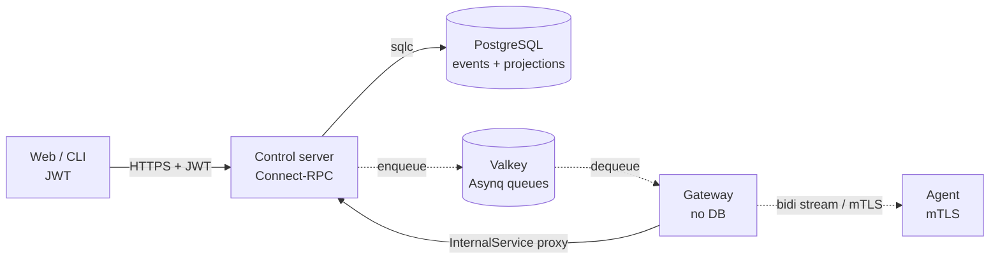

# Architecture

Four runtime components plus a Postgres and Valkey backing store.

## Control server

The control server is the only thing that touches Postgres. It hosts:

- The Connect-RPC `ControlService` over HTTPS + JWT for the web UI and CLI
- The OIDC callback for SSO sign-in
- The SCIM v2 endpoint for IdP user and group provisioning
- An internal mTLS-protected `InternalService` that the gateway calls for credential-bearing operations

State changes go into the event store. Reads come from projection tables that Go listeners keep current after each commit.

## Gateway

The gateway terminates mTLS from agents and runs the bidirectional Connect-RPC stream. No database. No credentials. Action dispatches arrive as Asynq tasks the control server enqueues; agent-reported execution events flow back through a separate Asynq inbox queue. Every Asynq envelope carries an HMAC so a compromised Valkey can't forge tasks.

## Agent

The agent runs on managed Linux endpoints. It:

- Enrols once through a local Unix socket using a registration token
- Receives a CA-signed client certificate and renews at 80% of its lifetime
- Streams heartbeats and execution results to the gateway
- Executes seventeen action types idempotently
- Keeps running scheduled work while disconnected

Each dispatch carries a CA-signature over `(actionID, type, paramsJSON)`. The agent verifies it before executing, so a tampered or forged dispatch is rejected.

## Indexer

The indexer is a small stateless service that drains search-index task events off Valkey into RediSearch indexes. It belongs to the search subsystem, not the control plane. Run zero, one, or many depending on load.

## Why event sourcing?

Every state change is an immutable event. Projections are derived; rebuild them from the event log whenever you need to. The result:

- The `events` table is the audit log; there is no second source of truth to drift.
- Past state can be reconstructed for debugging.
- Adding a field is a new event, not a destructive migration.
- An actor and sequence number on every event make missing entries visible.

See [Event sourcing](/concepts/event-sourcing) for the projector pattern.
