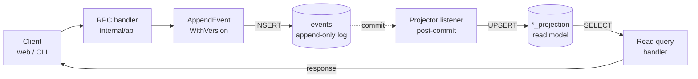

# Event sourcing

Every state-changing operation appends an immutable event to the `events` table. Reads come from projection tables (`*_projection`) kept current by Go projector listeners that fire after the event commits. The `events` table itself is the audit log.



## Why not mutate the projection directly?

You'd save maybe 5ms of write latency. In exchange:

- No record of who did what, when, with what payload.
- A corrupted projection can't be rebuilt; the history is gone.
- A new column means a destructive migration. A new event type is purely additive.
- You lose the optimistic-concurrency knob that `UNIQUE (stream_type, stream_id, stream_version)` on the events table gives you.

## Projector pattern

A projector is two pure functions plus a wiring step:

```go
// 1. Decoder. Pure, no DB access. Validates the event payload
// against the typed schema and returns a normalised struct.
func FooBarHappenedFromEvent(e store.PersistedEvent) (FooBarHappenedPayload, error) {
    if e.StreamType != "foo" || e.EventType != string(eventtypes.FooBarHappened) {
        return FooBarHappenedPayload{}, ErrIgnoredEvent
    }
    var raw payloads.FooBarHappened
    if err := json.Unmarshal(e.Data, &raw); err != nil {
        return FooBarHappenedPayload{}, fmt.Errorf("projector: invalid FooBarHappened payload: %w", err)
    }
    // ... validate required fields, apply defaults
    return out, nil
}

// 2. Apply. sqlc-driven, runs inside WithTx so the projection
// write commits atomically with whatever other state changes the
// event implies.
func applyFooBarHappened(ctx context.Context, q *store.Queries, e store.PersistedEvent) error {
    payload, err := FooBarHappenedFromEvent(e)
    if err != nil { return err }
    return q.InsertFooBarProjection(ctx, db.InsertFooBarProjectionParams{ /* ... */ })
}
```

`FooBarListener` wires the two together and gets registered on store boot via `projectors.WireAll(store, logger)`.


Decoder unit tests live in `internal/projectors/foo_test.go` with table-driven fixtures and synthetic `store.PersistedEvent` values; no DB needed. Listener integration tests in the same file write events through `AppendEvent` and assert the projection row appears.


## Optimistic concurrency

`AppendEvent` auto-increments `stream_version` and retries internally on `23505` unique-constraint violations. `AppendEventWithVersion` takes a caller-supplied expected version; use it when the handler needs to assert nothing has touched the stream since it read the projection.

[F-07](/security/threat-model) (the TOTP backup-code consume) is a worked example of using `AppendEventWithVersion` to race-protect a CQRS operation.
