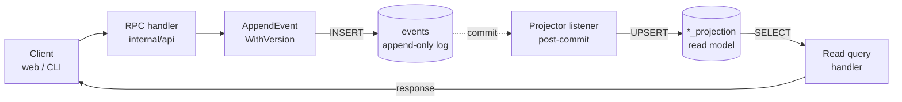

# Event sourcing

Every state-changing operation in Power Manage appends an immutable event to the `events` table. Read paths consult **projection tables** (`*_projection`) that are kept up to date by Go-side **projector listeners** that fire post-commit. The events table itself is the canonical audit log.



## Why not just mutate the projection directly?

Mutating the projection directly would buy ~5ms of write latency but cost us:

- **Auditability** — there's no record of who did what, when, with what payload.
- **Replayability** — a corrupt projection can't be rebuilt from history.
- **Schema evolution** — a new column means a destructive migration; a new event type is purely additive.
- **Concurrency control** — the events table's `UNIQUE (stream_type, stream_id, stream_version)` constraint is the optimistic-concurrency knob the whole system relies on.

## Projector pattern

A projector is two pure functions plus a wiring step:

```go
// 1. Decoder — pure, no DB access. Validates the event payload
// against the typed schema and returns a normalised struct.
func FooBarHappenedFromEvent(e store.PersistedEvent) (FooBarHappenedPayload, error) {
    if e.StreamType != "foo" || e.EventType != string(eventtypes.FooBarHappened) {
        return FooBarHappenedPayload{}, ErrIgnoredEvent
    }
    var raw payloads.FooBarHappened
    if err := json.Unmarshal(e.Data, &raw); err != nil {
        return FooBarHappenedPayload{}, fmt.Errorf("projector: invalid FooBarHappened payload: %w", err)
    }
    // ... validate required fields, apply defaults
    return out, nil
}

// 2. Apply — sqlc-driven, runs inside a WithTx so the projection
// write commits atomically with whatever other state changes the
// event implies.
func applyFooBarHappened(ctx context.Context, q *store.Queries, e store.PersistedEvent) error {
    payload, err := FooBarHappenedFromEvent(e)
    if err != nil { return err }
    return q.InsertFooBarProjection(ctx, db.InsertFooBarProjectionParams{ /* ... */ })
}
```

The listener factory `FooBarListener` wires the two together and is registered on store boot via `projectors.WireAll(store, logger)`.


Decoder unit tests live in `internal/projectors/foo_test.go` and use table-driven fixtures with synthetic `store.PersistedEvent` values — no DB needed. Listener integration tests in the same file write events via `AppendEvent` and assert the projection row appears.


## Optimistic concurrency

`AppendEvent` auto-increments `stream_version`; retries internally on `23505` unique-constraint violations. `AppendEventWithVersion` takes a caller-supplied expected version — used when the handler needs to enforce that nothing else has touched the stream since it read the projection.

See [F-07](/security/threat-model) (TOTP backup-code consume) for a worked example of using `AppendEventWithVersion` to race-protect a CQRS operation.
