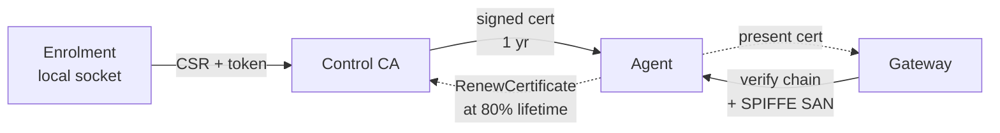

# mTLS and signed actions

mTLS terminates at the gateway. Every agent presents a CA-signed client certificate. The gateway verifies it through `tls.RequireAndVerifyClientCert` plus a SPIFFE URI SAN check that pins the peer's class: `agent` for device agents, `gateway` and `control` for the inter-service mTLS the `InternalService` proxy uses.

## Certificate lifecycle

| Stage | What happens |
|---|---|
| Enrolment | The agent generates a key, sends a CSR through the local `enroll.sock` Unix socket gated by a single-use registration token. The control server signs a cert valid for **1 year**. |
| Steady state | The agent presents the cert on every gateway connection. The gateway verifies the chain and the SPIFFE SAN. |
| Renewal | At **80% of cert lifetime** (~292 days in), the agent calls `RenewCertificate` over its existing mTLS connection. The control server validates the fingerprint, issues a new cert, returns it. |
| Revocation | Not implemented yet. The agent CA is the only revocation lever — rotate it to invalidate every issued cert at once. A `RevokeCertificate` RPC with a per-fingerprint gateway deny-list is on the [Roadmap](/operations/roadmap). |

The CA roots used to sign agent certs are separate from the gateway's server cert and from the control server's HTTPS cert. The 2026.06 milestone is finishing **CA role separation** so the agent CA, the inter-service CA, and the HTTPS CA are independently rotatable.

## Signed actions

On top of mTLS, every dispatched action carries an RSA signature over `(actionID, type, paramsJSON)`. The agent verifies it before executing. That means:

- A compromised gateway can't forge a dispatch the agent will run. The agent rejects anything unsigned or tampered with.
- Action-payload integrity is end-to-end (control → agent), not hop-by-hop.
- Instant actions (`REBOOT`, `SYNC`) are signed over `actionID || type || "{}"`. The same verifier covers parameterless actions.

If the signature doesn't verify, the agent records an `ExecutionFailed` event with the verification error and drops the dispatch. The event ends up in the audit log, so a forgery attempt leaves a trace.

## What the agent verifies, in order

For every dispatch arriving over the bidirectional stream:

1. **TLS handshake.** Gateway cert chain and hostname.
2. **Stream identity.** The agent confirms the gateway is presenting a cert with the `gateway` SPIFFE class.
3. **Envelope HMAC.** The Asynq task-signing key check (see [Asynq task signing](/security/task-signing)) catches Valkey tampering before the gateway forwards anything.
4. **Action signature.** The per-action RSA signature.
5. **Action-type sanity.** The payload deserialises into the expected proto schema and passes inline validation.

A failure at any layer ends the dispatch and emits an event. No silent drops.

## Trust-bundle reloads

The control CA's certs are loaded from disk when the control container boots. Today, picking up a new bundle requires `docker compose restart control gateway` so both processes re-read the on-disk material. Agents stay authenticated under their existing certificates until their next renewal (driven by the agent itself at 80% lifetime), so the restart isn't disruptive to the fleet.

A live trust-bundle reload (without restart) and an admin-initiated force-renew are tracked as part of the CA rotation playbook in the upcoming `SECURITY.md` ADR landing in 2026.06.
