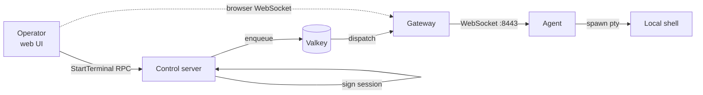

# Remote terminal access

The agent can open an interactive shell to authorised operators through the control server. The tool you reach for when an action's audit trail isn't enough and you need to actually look at the box.

The trust model leans toward the device. The agent decides whether terminal access is allowed at all. The server cannot bypass that decision.

## Enabling terminal access on a device

Terminal access is **disabled by default**. To turn it on, sign in to the device as a local administrator and run:

```bash
sudo power-manage-agent tty enable
```

This writes a flag into the agent's local data directory. Until that flag is set, no terminal session can attach to this device, regardless of who is asking. The agent enforces this locally; the server has no way to override it.

To turn it back off:

```bash
sudo power-manage-agent tty disable
```

## The session flow



1. The operator clicks **Terminal** on a device page in the web UI.
2. The web UI calls `StartTerminal` on the control server.
3. The control server checks the operator's permission (`StartTerminal` is a discrete RBAC permission, granted via roles), signs a session token, and dispatches it to the agent.
4. The agent verifies the signature, checks its local enable flag, spawns a PTY, and reports the WebSocket endpoint.
5. The operator's browser opens a WebSocket directly to the gateway's `:8443` endpoint, authenticated with `Sec-WebSocket-Protocol` carrying the session bearer.
6. Bytes flow in both directions through the gateway, end-to-end mTLS to the agent.

The session lives in a SQLite store inside the agent's data directory (so it survives an agent restart). All session creation, attach, detach, and termination events get recorded in the audit log.

## Permissions

Four RBAC permissions cover the terminal lifecycle:

| Permission | What it grants |
|---|---|
| `StartTerminal` | Open a new terminal session against a device |
| `StopTerminal` | End your own session early |
| `ListActiveTerminalSessions` | See every open session in the fleet |
| `TerminateTerminalSession` | Force-end someone else's session (admin override) |

A scoped `StartTerminal:assigned` variant restricts you to devices you've been assigned. Use it for support engineers who shouldn't see the whole fleet.

The 2026.06 milestone introduces two preset roles, `TerminalAdminLimited` and `TerminalAdminFull`, that bundle these permissions with the right scopes. Until that lands you assemble them yourself.

## What's recorded

Every keystroke that crosses the WebSocket is captured by the agent and shipped back to the control server as session output events. The audit log shows:

- Session start: operator, device, requested duration, signed token id
- Session attach / detach: WebSocket connect / disconnect timestamps
- Session output: full input + output stream, recorded per chunk
- Session end: who closed it (operator, agent, force-terminated)

Redaction is **not** automatic. If you `cat /etc/shadow` in a session, the audit log has `/etc/shadow`. Be deliberate about who you give `StartTerminal` to.

## Open questions

Three things the 2026.06 milestone has to settle.

**Sudo I/O capture.** When `sudo` runs inside a session, should the capture keep tagging output with the operator's identity through the privilege jump, or treat it as opaque?

**Editor escapes.** A session that opens `vi` and runs `:!sh` currently slips out of the captured-output stream. Two options on the table: capture stays through the spawn (intrusive but complete) or the log accepts a gap (faithful but incomplete).

**TTY auth model.** The device's enable flag is currently permanent until disabled. Should it be time-boxed, or operator-requested instead? Permanent is simplest but means a one-time grant can't auto-revoke.

ADRs are in flight for each. See [Roadmap](/operations/roadmap).
